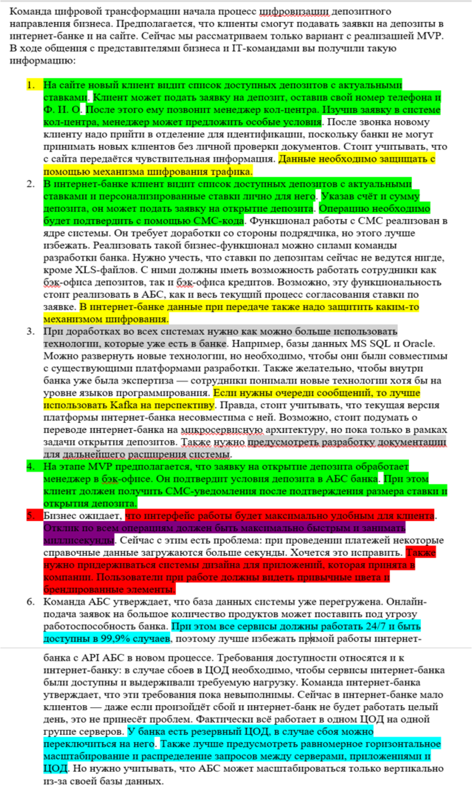

## Таблица FURPS
|Код|Требования|Комментарий|
|-|-|-|
| F|Функциональные (Functionality)||
|1|Я, как посетитель Сайта, хочу иметь возможность подать заявку на депозит с указанием своих контактных данных, для экономии времени, затрачиваемого на открытие депозита||
|2|Я, как посетитель Сайта хочу иметь возможность просмотреть список предлагаемых банком депозитов с актуальными ставками, для экономии времени, затрачиваемого на выбор и открытие депозита||
|3|Я, как менеджер call-центра должен иметь возможность просмотреть поданные заявки и зафиксировать в заявке особые условия, для того что бы клиент принял решение открыть депозит||
|4|Я, как клиент Интернет-банка, хочу иметь возможность просмотреть список доступных мне депозитов с персональным ставками, для экономии времени, затрачиваемого на выбор и открытие депозита||
|5|Я, как клиент Интернет-банка, хочу иметь возможность создать зявку на открытие депозита с указанием счёта и суммы депозита, для экономии времени, затрачиваемого на выбор и открытие депозита||
|6|Я, как клиент Интернет-банка, хочу иметь возможность подтверждения заявки на открытие депозита с помощью СМС, для снижения риска ошибочных или мошеннических действий от моего имени||
|7|Я, как сотрудник отдела кредитования, хочу иметь возможность согласования ставки депозита, для снижения времени, затрачиваемого на обработку заявки на открытие депозита||
|8|Я, как сотрудник отдела кредитования, хочу иметь возможность расчета итоговой ставки по депозитам, для снижения времени, затрачиваемого на обработку заявки на открытие депозита||
|9|Я, как менеджер call-центра должен иметь возможность просмотреть итоговые ставки по депозитам и указать их в заявке, для снижения времени, затрачиваемого на обработку зявки на открытие депозита||
|10|Я, как менеджер бэк-офиса, должен иметь возможность подтверждения условий депозита в заявке на открытие депозита (при этом депозит должен автоматически открываться в АБС), для снижения времени, затрачиваемого на обработку заявки на открытие депозита||
|11|Я, как клиент банка, хочу иметь возможность получать СМС с оповещением об открытии депозита с указанием условий депозита, для снижения риска ошибочных или мошеннических действий от моего имени||
|U|Удобство использования (Usability)||
|1|Интерфейс работы в Интернет-клиенте должен быть максимально удобным для клиента|Необходима детализация|
|2|Дизайн Интернет-банка должен соответствовать системе дизайна для приложений, которая принята в компании||
|3|Дизайн Сайта должен соответствовать системе дизайна для приложений, которая принята в компании||
|R|Надёжность (Reliability)||
|1|Доступность АБС 99,9%||
|2|Доступность Интернет-банка 99,9%||
|3|Доступность системы call-центра 99,9%||
|4|В случае недоступности АБС, Интернет-банк должен иметь возможность принимать заявки||
|5|Предусмотреть равномерное горизонтальное масштабирование и распределение запросов между серверами, приложениями и ЦОД||
|6|Переключение на резервный ЦОД должно осуществляться в ручном режиме
||
|P|Производительность (Performance)||
|1|Отклик по всем операциям c API должен быть максимально быстрым и занимать не более (строго меньше) 1 секунды||
|S|Поддерживаемость (Supportability)||
|1|Должна быть разработана документация на существующее решение и разрабатываемое MVP|Инструкция по развертыванию; Спецификация API; Структура БД; Очереди и формат сообщений Система классификации и кодирования|
|2|При доработках во всех системах нужно как можно больше использовать технологии и языки программирования, которые уже есть в банке||
|R+|Ограничения (Restricitions) +||
|1|Для очереди сообщений необходимо использовать Kafka||
|2|Трафик с Сайта должен передаваться по https||
|3|Трафик с Интернет-клиента должен передаваться по https||
|4|Не дорабатывать функционал подрядчика в интернет-банке||
|5|Использовать платформы Java, .NET, PHP||
|6|Нужно использовать микросервисную архитектуру при разработке в интернет-банке||
|7|АБС поддерживает только вертикальное масштабирование||
|8|Следует избегать прямого обмена данными между онлайн-банком и АБС||
|9|Использовать существующие базы данных Oracle, MS SQL||

### Пояснения к таблице
