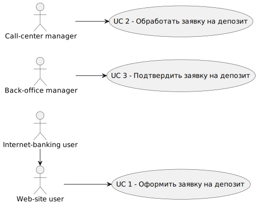
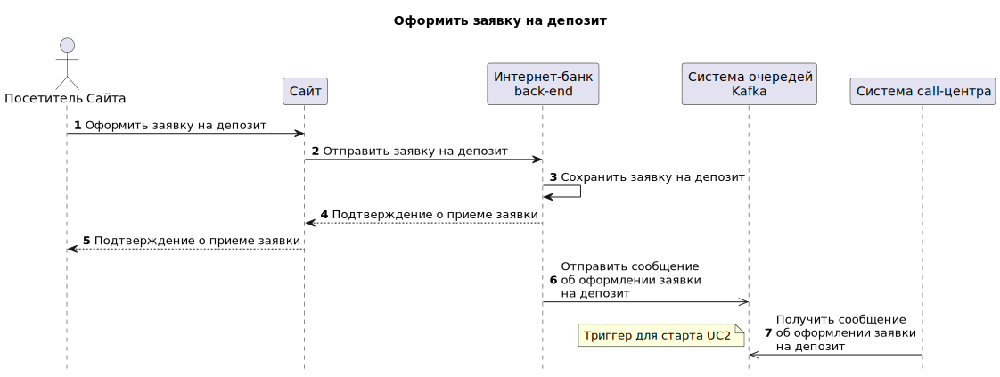
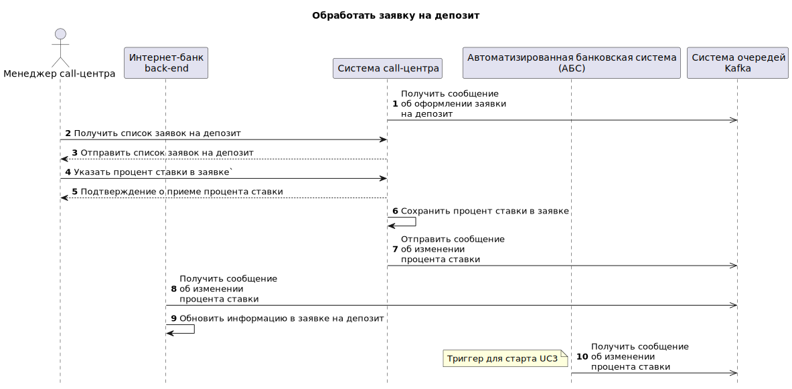
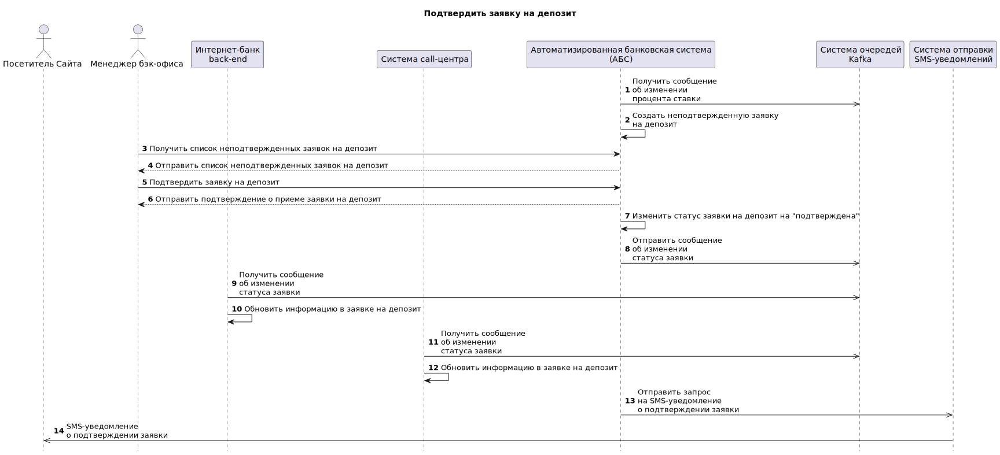
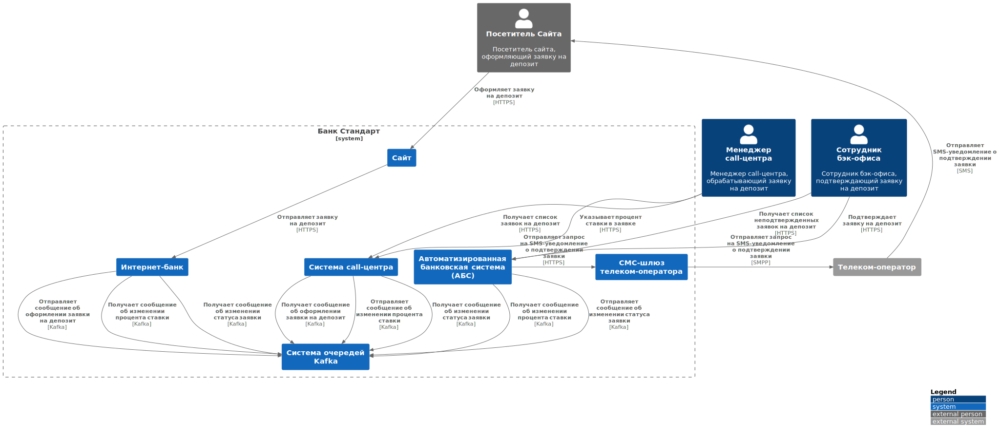
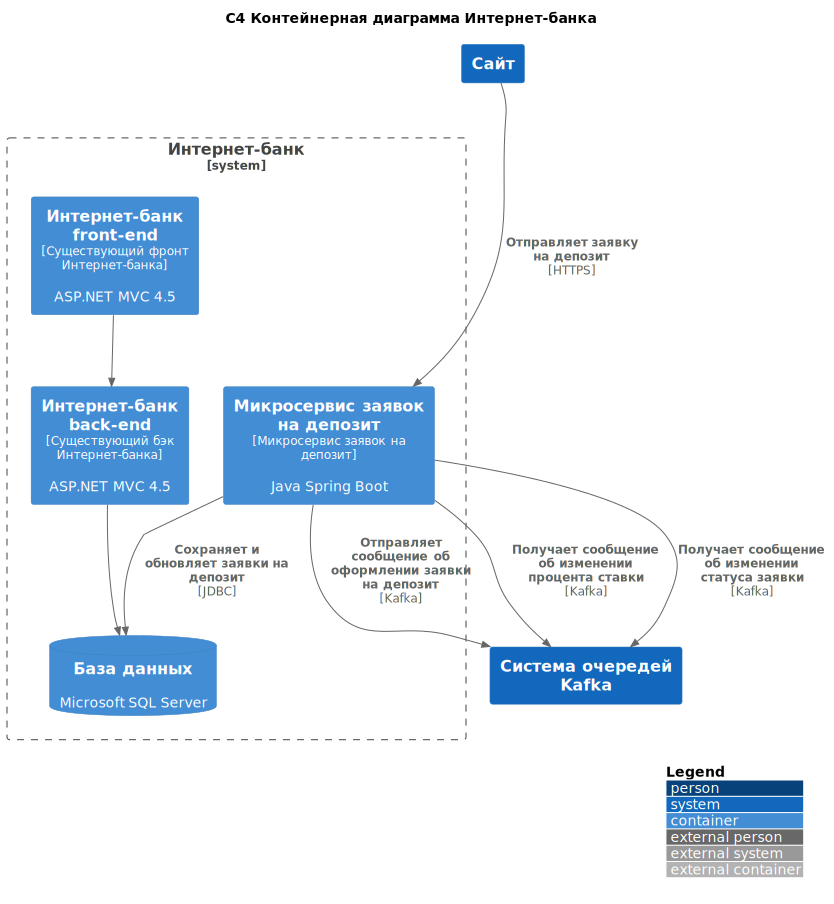
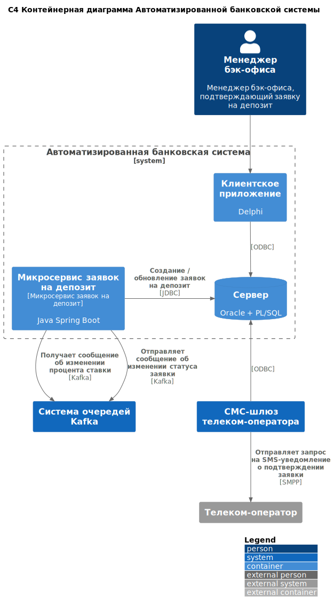

# Депозиты онлайн - MVP
## High level solution design

### Функциональные требования

#### UC1 - Оформить заявку на депозит

#### UC2 - Обработать заявку на депозит

#### UC3 - Подтвердить заявку на депозит

### Нефункциональные требования
| Код FURPS+ | Описание                                                                                                     |
|:----------:|--------------------------------------------------------------------------------------------------------------|
|     U3     | Дизайн Сайта должен соответствовать системе дизайна для приложений, которая принята в компании               |
|     R1     | Доступность АБС 99,9%                                                                                        |
|     R2     | Доступность Интернет-банка 99,9%                                                                             |
|     R3     | Доступность системы call-центра 99,9%                                                                        |
|     R4     | В случае недоступности АБС, Интернет-банк должен иметь возможность принимать заявки                          |
|     P1     | Отклик по всем операциям c API должен быть максимально быстрым и занимать не более (строго меньше) 1 секунды |
|    +R1     | Для очереди сообщений необходимо использовать Kafka                                                          |
|    +R2     | Трафик с Сайта должен передаваться по https                                                                  |
|    +R3     | Трафик с Интернет-клиента должен передаваться по https                                                       |

### Решение

#### C4 контекст

#### C4 контейнер

### Альтернативы
1. Использовать прямые вызовы API при интеграции с другими системами банка (не использовать Kafka) - На первых стадиях цифровизации бизнеса банка это позволит снизить затраты на разработку и сопровождения. В дальнейшем, при росте систем взаимодействующих между собой, количество прямых связей между системами радикально возрастет, что будет затруднять дальнейшие развитие и сопровождение систем.
2. Не использовать MS SQL сервер при разработке микросервиса по работе с депозитами в Интернет-банке - Команде придется поддерживать 2 разные БД, что повысит стоимость сопровождения системы. Возможно, стоит дополнительно обсудить перспективы Интернет-банка и возможности его разделения на микросервисы и миграции на современные технологии. В случае положительного решения о скором рефакторинге Интернет-банка в целом, можно предусмотреть отдельную БД для микросервиса работы с депозитами. Рекомендуемая технология - PostgreSQL.
3. Не использовать Oracle сервер при разработке микросервиса по работе с депозитами в АБС - Команде придется поддерживать 2 разные БД, что повысит стоимость сопровождения системы, при этом вероятность замены АБС крайне мала.

### Недостатки, ограничения, риски
1. В виду того, что обеспечение доступности информации о ставках реализуется позже настоящего проекта, UCs в которых необходима информация о ставках не описываются
2. Для обеспечения возможности подачи с Сайта заявок на депозиты (и других интеракций с неаутентифицированными пользователями в дальнейшем), будет использоваться бэк Интернет-банка, расширяемый за счет новых микросервисов
3. Риск: не будут выделены средства на продление лицензий Microsoft SQL Server. Риск принимается. Действия по снижению вероятности риска: Заложить в план развития компаниии на 5 лет бюджет на лицензии с учётом роста нагрузки 
4. не будут выделены средства на продление лицензий Oracle. Риск принимается. Действия по снижению вероятности риска: Заложить в план развития компаниии на 5 лет бюджет на лицензии с учётом роста нагрузки 