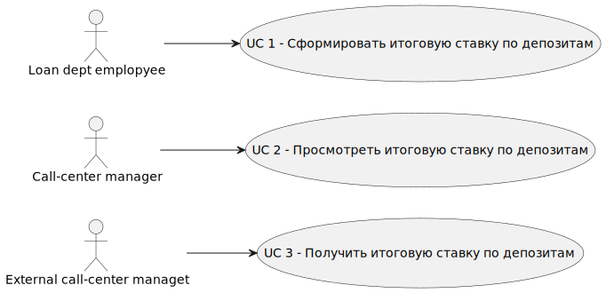
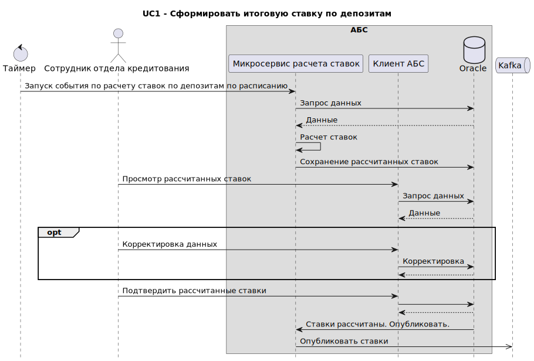
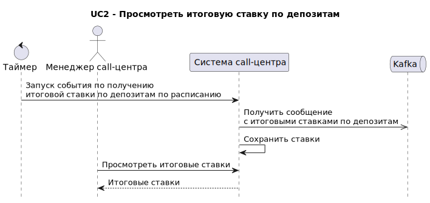
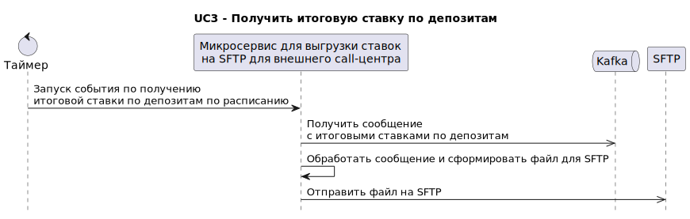
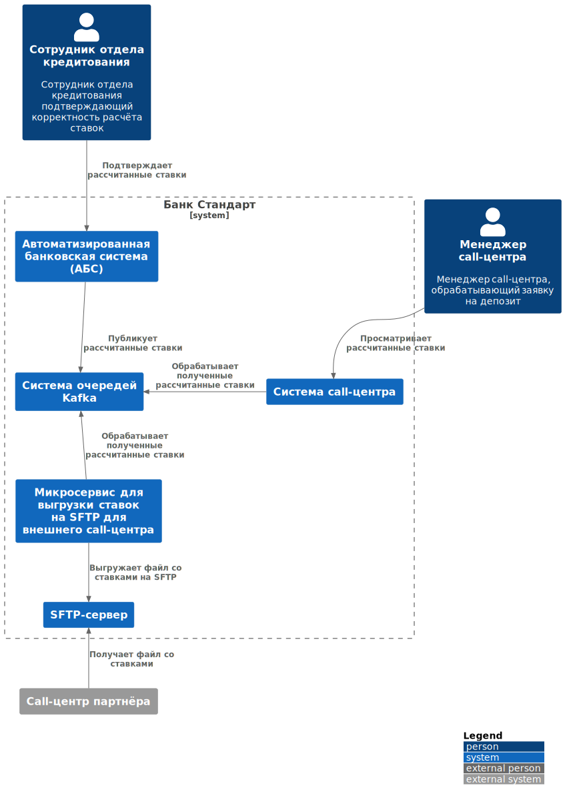
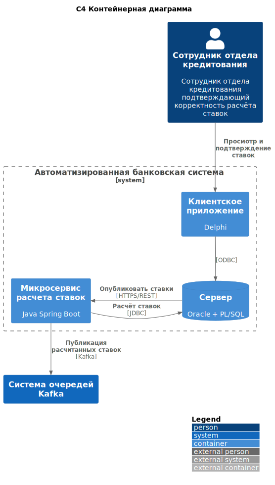

# Передача ставок в кол-центр - MVP
## High level solution design

### Функциональные требования

#### UC1 - Сформировать итоговую ставку по депозитам

#### UC2 - Просмотреть итоговую ставку по депозитам

#### UC3 - Получить итоговую ставку по депозитам 

### Нефункциональные требования
| Код FURPS+ | Описание                                                                                                     |
|:----------:|--------------------------------------------------------------------------------------------------------------|
|     R1     | Доступность АБС 99,9%                                                                                        |
|     R3     | Доступность системы call-центра 99,9%                                                                        |
|     P1     | Отклик по всем операциям c API должен быть максимально быстрым и занимать не более (строго меньше) 1 секунды |
|    +R1     | Для очереди сообщений необходимо использовать Kafka                                                          |

### Решение

#### C4 контекст

#### C4 контейнер

### Альтернативы
1. Передавать рассчитанные ставки в другие системы с помощью файловой интеграции. Реализовать всю логику по формированию файла внутри АБС - в целом тоже рабочее решение, но чуть менее гибкое и расширяемое по сравнению с предложенным. Файловая интеграция менее надежная и безопасная по сравнению с интеграцией через Kafka, решение менее гибкое, т.к. все потребители привязаны к одному формату файла и, в случае необходимости одному из потенциальных потребилетей выгружать данные в файле другого формата, придется дополнять логику силами команды АБС, а не силами команды потребителя.
2. Отправлять внешнему call-центру файл не через SFTP а по e-mail - небезопасный вариант, т.к. почта ходит по незащищенным и неконтроллируемым каналам, а ставки - информация ограниченного доступа. 

### Недостатки, ограничения, риски
1. MVP не затрагивает UCs, связанные с контролем корректности (сверки) значений ставок в различных системах
